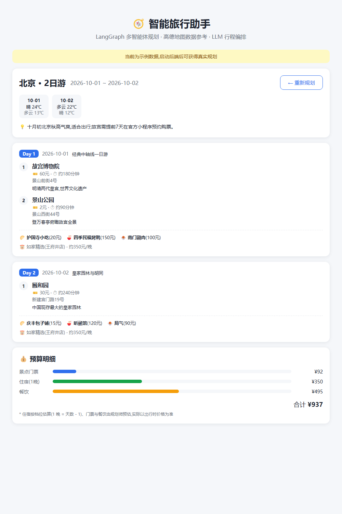
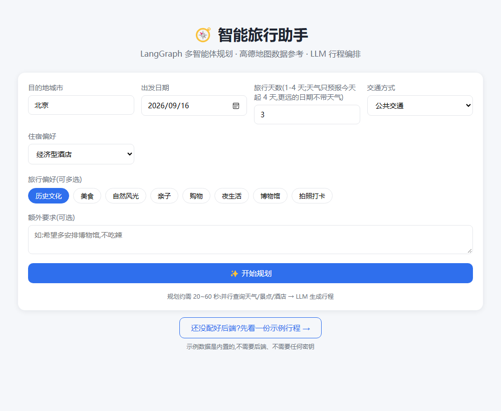

# LangGraph 智能旅行助手

用 **LangGraph** 实现的旅行规划系统。

**目录只有两个平级文件夹:`backend/`(Python) 和 `frontend/`(Vue),互不依赖,通过 HTTP 通信。**



## 先看效果(不用申请密钥)

项目内置了**演示模式**:一份完整的结果页(北京 2 日游 —— 天气条、每日行程、三餐、酒店、预算),
数据是内置的,**不发任何网络请求、不需要后端、不需要任何密钥**。

两种进入方式:

- 打开页面后,点表单下方的「**还没配好后端?先看一份示例行程 →**」;
- 或者直接在地址后面加 `?demo=1`,例如 `http://localhost:5173/?demo=1` ——
  部署之后可以把这个链接贴出来当在线预览。



从表单页点一下,就会直接进入演示结果页(就是本文顶部那张图)。

演示数据在 `frontend/src/mockPlan.ts`,用**动态 import** 加载,
所以只有真的进演示模式才会下载那 2 KB,不影响正常访问的体积。

## 整体架构

```
┌────────────────── frontend/ (Vue 3 + Vite, 端口 5173) ──────────────────┐
│  规划表单 → 真实进度面板(SSE驱动,可取消) → 结果页(天气/每日行程/预算) + 可选地图 │
└──────────────────────────────┬──────────────────────────────────────────┘
                               │ POST /api/plan 或 /api/plan/stream (SSE)
┌──────────────────────────────▼──────────────────────────────────────────┐
│                       backend/ (Python + FastAPI, 端口 8000)            │
│                                                                         │
│   START ─┬─► weather_node(高德天气)────┐                                │
│          ├─► attraction_node(景点)────┼─► planner ─► validate ─┬─► budget ─► END
│          └─► hotel_node(酒店)─────────┘   并行执行  结构化输出 │      确定性算账
│      三个采集节点各自容错降级              校验不合格+重试环 ◄──┘        │
└─────────────────────────────────────────────────────────────────────────┘
```

## 目录结构

```
Travel_assistant/
├── backend/                    # ============ Python 后端 ============
│   ├── app/
│   │   ├── config.py           # .env 配置(绝对路径定位,不依赖启动目录)
│   │   ├── models/schemas.py   # Pydantic 数据契约(前后端共享的"唯一事实来源")
│   │   ├── services/
│   │   │   ├── amap_service.py # 高德 REST API(统一 status 检查 + 字段清洗)
│   │   │   └── llm.py          # LLM 客户端(带 timeout 和自动重试)
│   │   └── graph/
│   │       ├── state.py        # LangGraph 图状态定义(含 reducer + 重试环字段)
│   │       ├── nodes.py        # 6 个节点:3采集(各自容错) + 规划 + 校验 + 预算
│   │       └── trip_graph.py   # 组装 StateGraph(并行扇出/汇合 + 条件边重试环)
│   ├── api/server.py           # FastAPI(/api/plan 一次性 + /api/plan/stream SSE + 静态托管)
│   ├── main.py                 # CLI 入口(argparse,单次执行,同时拿进度和结果)
│   ├── smoke_test.py           # 冒烟测试:全打桩,不需要任何 Key
│   ├── tests/test_nodes.py     # pytest 单测:预算/温度清洗/日期校验/重试路由
│   ├── requirements.txt        # 运行时依赖(都带版本上界)
│   ├── requirements-dev.txt    # 测试依赖
│   └── .env.example            # 复制为 .env 并填入密钥
│
├── frontend/                   # ============ Vue 3 前端 ============
│   ├── src/
│   │   ├── App.vue             # 视图状态机: form → loading → result
│   │   ├── api.ts              # 调后端(SSE 流式解析 + 超时/取消)
│   │   ├── types.ts            # 与后端 schemas.py 对应的 TS 类型
│   │   ├── mockPlan.ts         # 演示模式的示例行程(动态加载,不进主包)
│   │   └── components/
│   │       ├── TripForm.vue    # 规划表单(城市/日期/偏好标签)
│   │       ├── LoadingPanel.vue# 真实进度面板(SSE 事件驱动,可取消)
│   │       ├── ResultView.vue  # 结果页头部(天气条/建议/告警)
│   │       ├── DayCard.vue     # 每日行程卡(景点/三餐/酒店)
│   │       ├── BudgetCard.vue  # 预算明细条形图(标注估算值与晚数)
│   │       └── AmapView.vue    # 高德地图(可选,需 JS API Key)
│   ├── package.json
│   └── .env.example            # 可选:地图 JS API Key
│
├── docs/                       # README 用的截图
├── .gitignore                  # 覆盖 backend/ 与 frontend/(node_modules、dist、.env 等)
└── README.md                   # 本文件
```

## 快速开始

### 第 1 步:配置后端密钥

```bash
cd backend
copy .env.example .env    # Windows;macOS/Linux 用 cp
# 编辑 .env,至少填入 LLM_API_KEY 和 AMAP_API_KEY
```

### 第 2 步:创建虚拟环境并安装依赖

```bash
cd backend
python -m venv .venv
.venv\Scripts\activate          # macOS/Linux: source .venv/bin/activate
pip install -r requirements-dev.txt
```

> `.venv/` 是本地创建的,已被 `.gitignore` 忽略,不会提交。

### 第 3 步:启动后端(终端 1)

```bash
cd backend
.venv\Scripts\activate
uvicorn api.server:app --reload
# Swagger 调试页: http://127.0.0.1:8000/docs
```

> 必须在 `backend/` 目录下启动:Python 需要能 `import app`,`config.py` 才能找到 `.env`。
> (`.env` 本身是绝对路径定位的,但 `import app` 仍依赖工作目录。)

### 第 4 步:启动前端(终端 2)

```bash
cd frontend
npm install
npm run dev
# 打开 http://localhost:5173
```

### 第 5 步(可选):构建前端,让后端一个端口托管整个应用

部署或演示时不用单独跑 Vite —— 后端会直接托管构建产物,一个端口同时提供页面和 API:

```bash
cd frontend
npm install          # 首次
npm run build        # 产物输出到 frontend/dist
```

然后重启后端(或等 `--reload` 自动重启),直接打开:

```
http://127.0.0.1:8000
```

不用再开前端 dev server。因为 `frontend/dist` 已经被 `.gitignore` 排除,**刚克隆下来的仓库没有这个目录**:后端启动时会检查它是否存在,存在才挂载到 `/`,不存在就只提供 API。所以新克隆的仓库打开 `:8000` 只看到 API、看不到页面 —— 先跑一次 `npm run build` 再重启后端即可。

> ⚠️ 走这条路时,改了前端源码**必须重新 `npm run build`** 才生效。想边改边看就用第 4 步的 dev server。

### 两种打开方式的区别

| | 第 4 步:Vite dev server | 第 5 步:后端托管 dist |
|---|---|---|
| 地址 | http://localhost:5173 | http://127.0.0.1:8000 |
| 需要几个终端 | 2(后端 + 前端) | 1(只要后端) |
| 页面来源 | Vite 实时编译 | `frontend/dist` 构建产物 |
| 改了前端源码 | 保存即自动刷新 | 要重新 `npm run build` |
| 「先看示例行程」按钮 | 显示 | 显示 |
| 适合 | 开发 | 部署 / 演示 |

### 其他入口

```bash
# 命令行直接规划(不需要前端)
cd backend && .venv\Scripts\activate
python main.py 北京 2026-10-01 3 --preferences 历史文化 美食
# 注意:--preferences 要放在最后,它会吃掉后面所有裸词

# 冒烟测试:全部打桩,不需要任何 Key,验证图能编译并跑通
cd backend && .venv\Scripts\activate
python smoke_test.py

# 单元测试(预算/温度清洗/日期校验/重试路由)
cd backend && .venv\Scripts\activate
python -m pytest tests/ -v

# 前端类型检查(vite build 用 esbuild,不做类型检查)
cd frontend
npm run typecheck

# 类型检查 + 构建一起做(发布前建议跑这个)
cd frontend
npm run build:checked
```

## 需要的密钥

| 密钥 | 申请地址 | 类型 | 放哪 | 用途 |
|------|---------|------|------|------|
| LLM_API_KEY | DeepSeek / 智谱 / OpenAI 等 | - | backend/.env | 行程规划(必需;思考型模型保持 `LLM_THINKING=false`) |
| AMAP_API_KEY | https://console.amap.com | **Web服务** | backend/.env | 天气 / POI 搜索(必需) |
| VITE_AMAP_JS_KEY | https://console.amap.com | **Web端(JS API)** | frontend/.env | 结果页地图(可选) |

⚠️ 高德两种 Key 不通用:后端用「Web服务」类型,前端地图用「Web端(JS API)」类型。

## 数据流

1. 前端表单提交 `TripRequest` → 后端 `/api/plan/stream`(SSE);
2. LangGraph 图并行执行天气/景点/酒店三个采集节点(各自容错:单点失败只降级不崩溃,堆栈进服务端日志);
3. `planner_node` 用 `with_structured_output` 让 LLM 把真实数据整合成 `TripPlan`;
4. `validate_node` 校验天数并写入 `plan_ok`,不合格时带着反馈走条件边回到 planner 重试(最多 2 次);
5. `budget_node` 在 Python 里精确累加预算(住宿按 N-1 晚计算);
6. SSE 事件实时推给前端进度面板,最后一条事件携带完整计划。

## 两个需要知道的行为

**天气预报只覆盖「今天起 4 天」。** 高德天气接口返回的是今天起 4 天,不是行程日期。
所以 `planner_node` 会按**日期**过滤:出行日期落在预报窗口之外时,行程里就不带天气
(而不是把不相干的日期硬塞进去)。这也是 `travel_days` 上限设为 4 的原因 ——
更长的行程仍然能生成,只是没有天气。

**行程内容由 LLM 编排,景点/门票价格属于模型预估。** 三个采集节点给出的是高德真实候选
(名称、地址、经纬度),但最终哪些景点进哪一天、门票多少钱、三餐吃什么,都是 LLM 生成的。
预算里的住宿费按档位固定的经验值估算,门票与餐饮是模型预估值,不要当成实际价格。

## 致谢

[HelloAgents](https://github.com/jjyaoao/HelloAgents)(CC-BY-NC-SA-4.0)